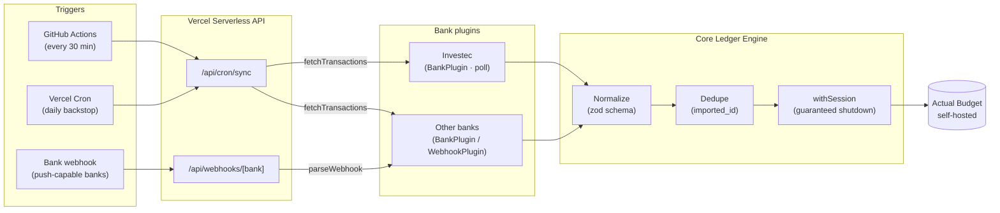

# Actual Bank Engine

[](https://github.com/nderman/actual-bank-engine/actions/workflows/ci.yml)
[](https://github.com/nderman/actual-bank-engine/actions/workflows/sync.yml)
[](./LICENSE)

Extensible banking → [Actual Budget](https://actualbudget.org) integration engine, built as a
pure **Vercel Serverless API**. Supports real-time **webhooks** and scheduled **Vercel Cron**
syncs through one normalization + ledger pipeline. New banks plug in via a small typed interface.

See **[SPECIFICATION.md](./SPECIFICATION.md)** for the full design contract.

## How it works



- **Exactly-once:** a transaction seen via both a webhook and a cron sweep is booked once,
  enforced by a deterministic `imported_id` (bank id, else a hash of invariant fields).
- **Serverless-safe:** `@actual-app/api` writes to `/tmp` (the only writable path on Vercel); the
  Actual session is always torn down with `actual.shutdown()` via a `finally` guard.

A plugin opts into either capability by implementing `BankPlugin` (polling) and/or
`WebhookPlugin` (push). The reference **Investec** plugin is **poll-only** — Investec's Account
Information API has no webhooks. The `WebhookPlugin` interface and `/api/webhooks/[bank]` route
remain for banks that *do* push events (Monzo, TrueLayer, GoCardless, …).

## Project layout

| Path | Purpose |
|---|---|
| `api/webhooks/[bank].ts` | Real-time ingestion endpoint (for push-capable banks) |
| `api/cron/sync.ts` | Scheduled polling sweep |
| `src/core/` | Schema, plugin contracts, dedupe, Actual client, ledger engine |
| `src/plugins/investec/` | Reference plugin (OAuth client-credentials polling) |
| `vercel.json` | Cron schedule + function durations |

## Develop

```bash
npm install
npm run typecheck   # tsc --noEmit
npm run test        # node:test via tsx
npm run lint
```

## Add a bank plugin

1. Create `src/plugins/<bank>/` implementing `BankPlugin` and/or `WebhookPlugin`
   (see `src/core/plugin.ts`). Output **only** `NormalizedTransaction` (see `src/core/schema.ts`).
2. Register it in `src/plugins/registry.ts` (one import + array entry).
3. Add its env vars to `src/core/config.ts` and `.env.example`.

Plugins are pure translators — they never talk to Actual or dedupe; the core engine does that.

## Configure

Copy `.env.example` → `.env` and fill in your Actual server + bank credentials. On Vercel, set
these as Environment Variables and add `CRON_SECRET` (presented by Vercel Cron as a bearer token).

## Initial backfill & balances

The scheduled sync only pulls a rolling 3-day window. For first-time setup:

- **Backfill history** — call the endpoint with a wider window (bearer-authed, capped at 730 days):
  ```bash
  curl -H "Authorization: Bearer $CRON_SECRET" \
    "https://<app>.vercel.app/api/cron/sync?days=730"   # or ?from=YYYY-MM-DD&to=YYYY-MM-DD
  ```
- **Reconcile balances** — Actual derives an account balance from its transactions, so if history
  doesn't reach the account's opening it won't match the bank. `npm run reconcile` fetches each
  account's current Investec balance and writes a single self-correcting opening-balance
  adjustment so Actual matches reality. Re-runnable.

## Scheduling

Two triggers hit the same `/api/cron/sync` endpoint; overlap is harmless (deduped by `imported_id`):

- **Vercel Cron** (`vercel.json`) — daily backstop. The free Hobby plan only allows once-daily cron.
- **GitHub Actions** (`.github/workflows/sync.yml`) — free, version-controlled, every 30 min. Set
  repo secrets `SYNC_URL` (`https://<app>.vercel.app/api/cron/sync`) and `CRON_SECRET` (same value
  as in Vercel). Manually runnable from the Actions tab.

GitHub may drift scheduled runs by a few minutes and auto-disables schedules after 60 days of repo
inactivity — fine here, since the multi-day lookback + daily Vercel backstop mean nothing is lost.

## Architecture decisions

Short records of the non-obvious choices and *why* — the alternatives considered are as
informative as the picks.

**1. Pure serverless, no database.** Dedup state and budget data live in Actual itself, so the
engine stays stateless and deploys free on Vercel. *Rejected:* a Postgres/KV "seen transactions"
table — it duplicates state Actual already owns and adds infra to run.

**2. `imported_id` is the dedup key, computed by the engine.** Both ingestion paths derive the
same deterministic id (bank id, else a hash of invariant economic fields), and Actual enforces
exactly-once on insert. *Rejected:* querying Actual for existing transactions before each insert
(racy under concurrent webhook + cron, and O(n) reads).

**3. Plugins are pure translators.** A plugin only maps bank data → `NormalizedTransaction`; it
never touches Actual, dedups, or decides what's imported. This keeps the contributor surface tiny
and fully unit-testable with fixtures. The strict `zod` schema fails a misbehaving plugin at *its
own* boundary, not deep in the engine.

**4. One guarded Actual session (`withSession`).** `@actual-app/api` holds a SQLite handle and
background workers; a function that returns without `actual.shutdown()` leaks memory across warm
invocations. A single `try/finally` wrapper is the *only* sanctioned entry point, so teardown can
never be forgotten. The cron sweep downloads the budget once and imports all plugins in that one
session.

**5. `/tmp` is scratch, never state.** Vercel functions are read-only except `/tmp`, which is
ephemeral. We point Actual's `dataDir` there and re-download the budget every invocation, so cold
starts (empty `/tmp`) are the normal path, not an error.

**6. Investec is poll-only.** Its Account Information API has no webhooks, so the plugin implements
`BankPlugin` only — verified against Investec's published OpenAPI spec. The generic `WebhookPlugin`
interface stays in core for banks that *do* push (Monzo, TrueLayer, GoCardless), proving the
design generalizes without carrying dead Investec-specific code.

**7. Scheduling = GitHub Actions + Vercel cron backstop.** Vercel's free tier caps cron at
once-daily, so a GitHub Actions schedule pings the same endpoint every 30 min — free, in-repo, and
version-controlled. The daily Vercel cron remains as a backstop; overlap is harmless because of
decision #2. *Rejected:* paying for Vercel Pro, or an external scheduler whose config lives outside
the repo.

## Release automation

Major (`X.0.0`) GitHub releases are announced to LinkedIn / X via Buffer using
[`release-social-action`](https://github.com/nderman/release-social-action)
(`.github/workflows/announce.yml`). To enable it, set in **Settings → Secrets and variables → Actions**:

- Secrets: `BUFFER_API_KEY`, `ANTHROPIC_API_KEY`
- Variables: `BUFFER_CHANNEL_IDS` (comma/newline-separated Buffer channel IDs)
